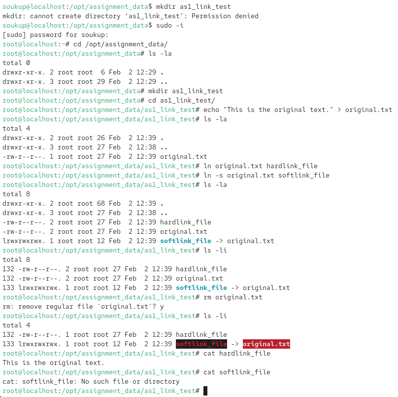
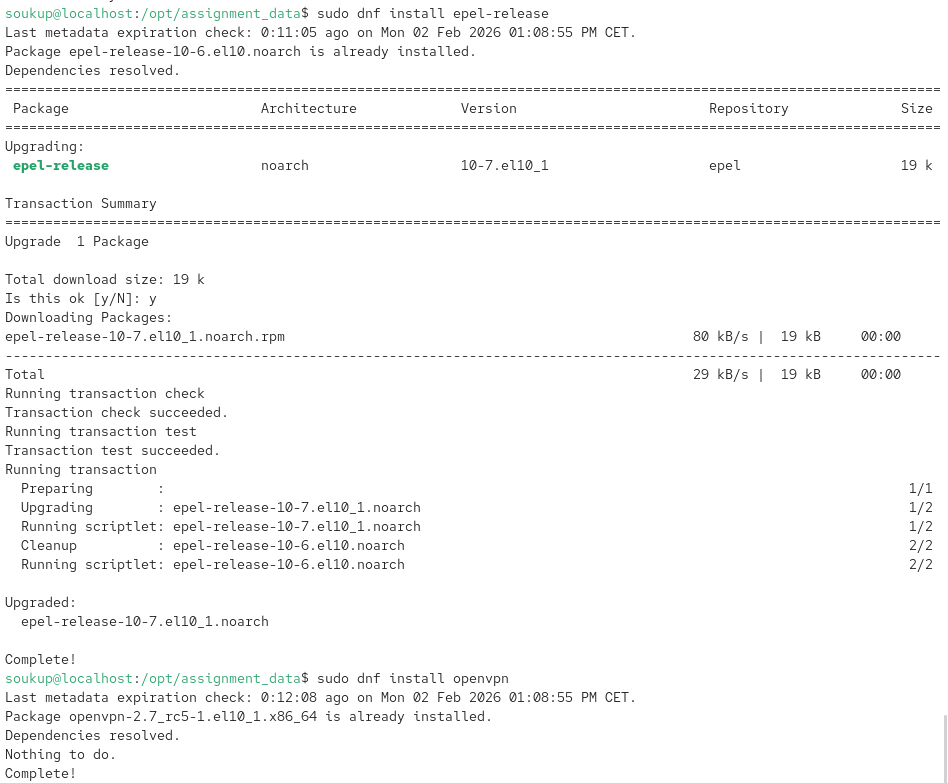
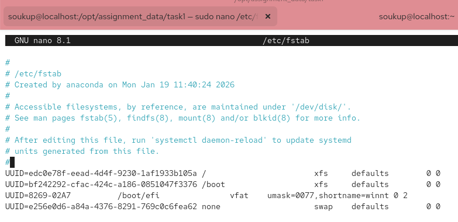
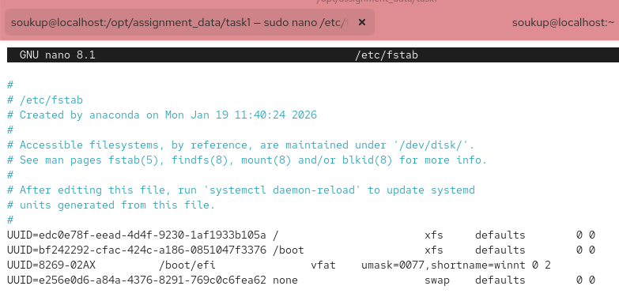
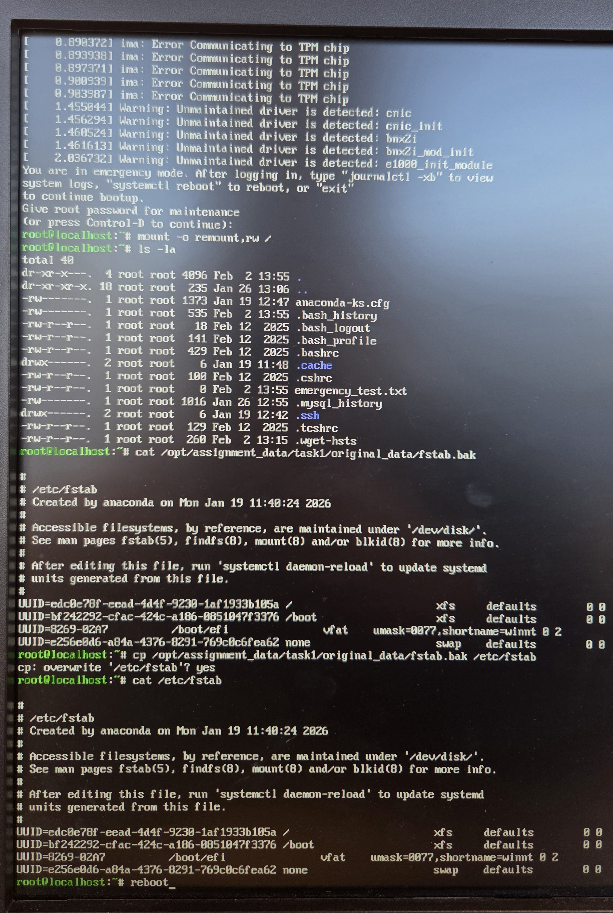
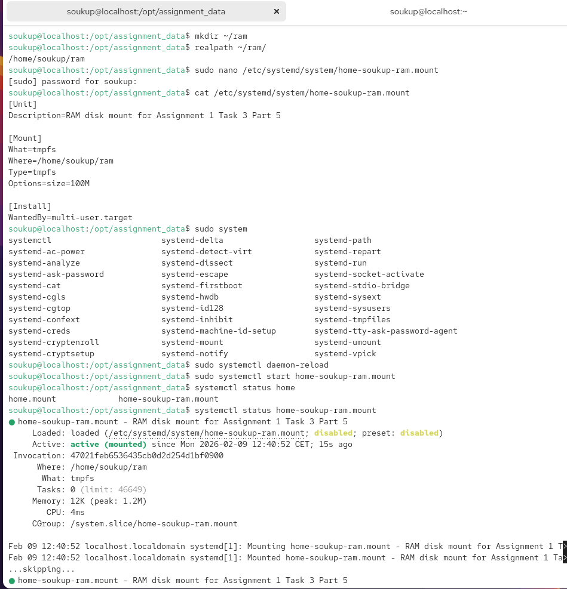
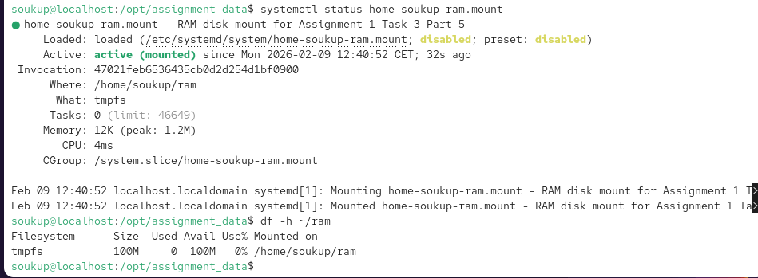

# DAT151: Assignment 1 Report

**Group Members:** Soukup Jan

**Date:** February 9, 2026

---

## Part 1 - The Filesystem

### Task 1: Filesystem basics

**1. Describe some of the key differences between the Linux/UNIX filesystem and Windows. How are files and folders organised in Linux/UNIX?**

**Hierarchy:** Linux uses a single unified tree structure starting at the root (`/`), whereas Windows uses drive letters (C:, D:) for different partitions.

**Case sensitivity:** Linux filenames are case-sensitive (`File.txt` and `file.txt` are different), while Windows is generally case-insensitive.

**File extensions:** Linux identifies file types by metadata/content rather than strictly relying on extensions like `.exe` or `.txt`.

**2. What is a mount point?**

**Definition:** A mount point is a directory in the existing filesystem hierarchy where a new filesystem (like a partition) is attached to make it accessible. It acts as an acces node, allowing the operating system to treat external storage as subdirectory

**Command execution (partition + mount):**

```bash
soukup@localhost:~$ sudo parted -s /dev/sda unit s print free
Model: ATA SAMSUNG MZ7PD256 (scsi)
Disk /dev/sda: 500118192s
Sector size (logical/physical): 512B/512B
Partition Table: gpt
Disk Flags: 

Number  Start       End         Size        File system  Name                  Flags
	34s         2047s       2014s       Free Space
 1      2048s       1230847s    1228800s    fat32        EFI System Partition  boot, esp
 2      1230848s    3327999s    2097152s    xfs                                bls_boot
 3      3328000s    481042431s  477714432s                                     lvm
	481042432s  500118158s  19075727s   Free Space

soukup@localhost:~$ sudo parted -s /dev/sda mkpart "dat151_assignment1_partition" xfs 481042432s 100%
soukup@localhost:~$ sudo mkfs -t xfs /dev/sda4
meta-data=/dev/sda4              isize=512    agcount=4, agsize=596096 blks
	 =                       sectsz=512   attr=2, projid32bit=1
	 =                       crc=1        finobt=1, sparse=1, rmapbt=1
	 =                       reflink=1    bigtime=1 inobtcount=1 nrext64=1
	 =                       exchange=0  
data     =                       bsize=4096   blocks=2384384, imaxpct=25
	 =                       sunit=0      swidth=0 blks
naming   =version 2              bsize=4096   ascii-ci=0, ftype=1, parent=0
log      =internal log           bsize=4096   blocks=16384, version=2
	 =                       sectsz=512   sunit=0 blks, lazy-count=1
realtime =none                   extsz=4096   blocks=0, rtextents=0
Discarding blocks...Done.

soukup@localhost:~$ sudo mkdir /opt/assignment_data
soukup@localhost:~$ sudo mount /dev/sda4 /opt/assignment_data
soukup@localhost:~$ df -h /opt/assignment_data
Filesystem      Size  Used Avail Use% Mounted on
/dev/sda4       9.1G  210M  8.9G   3% /opt/assignment_data

soukup@localhost:~$ lsblk /dev/sda4
NAME MAJ:MIN RM  SIZE RO TYPE MOUNTPOINTS
sda4   8:4    0  9.1G  0 part /opt/assignment_data
```

**3. In most UNIX systems, there are seven types of files defined. What are these? Use the file command to display the information of a few files. In which of the seven categories do these files belong?**

**Seven types:** 
Regular files (-) - Data files, executable programs, text files, or images
Directories (d) - Files that act as containers for other files and folder structures
Character devices (c) - Device files that handle data character-by-Character, such as terminals (/dev/tty) or printers.
Block devices (b) -Device files that handle data in blocks, typical for storage devices like hard drives (/dev/sda).
Local domain sockets(s) - Files used for inter-process communication, often over a network
Named pipes (FIFO)(p) - Used for inter-process communication, allowing data to flow from one process to another
Symbolic links (l) -Files that point to another file or directory (shortcuts)

**Commands used:**

```bash
ls -ld /etc/passwd /etc /dev/sda4 /dev/tty
```

**Categorization:**

- `/etc/passwd`: regular file (`-`).
- `/etc`: directory (`d`).
- `/dev/sda4`: block device (`b`).
- `/dev/tty`: character device (`c`).

**4. Hard links vs. symbolic links**

**Commands used:**

```bash
soukup@localhost:/opt/assignment_data$ sudo -i
root@localhost:~# cd /opt/assignment_data/
root@localhost:/opt/assignment_data# ls -la
total 0
drwxr-xr-x. 2 root root  6 Feb  2 12:29 .
drwxr-xr-x. 3 root root 29 Feb  2 12:29 ..
root@localhost:/opt/assignment_data# mkdir as1_link_test
root@localhost:/opt/assignment_data# cd as1_link_test/
root@localhost:/opt/assignment_data/as1_link_test# echo "This is the original text." > original.txt
root@localhost:/opt/assignment_data/as1_link_test# ls -la
total 4
drwxr-xr-x. 2 root root 26 Feb  2 12:39 .
drwxr-xr-x. 3 root root 27 Feb  2 12:38 ..
-rw-r--r--. 1 root root 27 Feb  2 12:39 original.txt
root@localhost:/opt/assignment_data/as1_link_test# ln original.txt hardlink_file
root@localhost:/opt/assignment_data/as1_link_test# ln -s original.txt softlink_file
root@localhost:/opt/assignment_data/as1_link_test# ls -la
total 8
drwxr-xr-x. 2 root root 68 Feb  2 12:39 .
drwxr-xr-x. 3 root root 27 Feb  2 12:38 ..
-rw-r--r--. 2 root root 27 Feb  2 12:39 hardlink_file
-rw-r--r--. 2 root root 27 Feb  2 12:39 original.txt
lrwxrwxrwx. 1 root root 12 Feb  2 12:39 softlink_file -> original.txt
root@localhost:/opt/assignment_data/as1_link_test# ls -li
total 8
132 -rw-r--r--. 2 root root 27 Feb  2 12:39 hardlink_file
132 -rw-r--r--. 2 root root 27 Feb  2 12:39 original.txt
133 lrwxrwxrwx. 1 root root 12 Feb  2 12:39 softlink_file -> original.txt
root@localhost:/opt/assignment_data/as1_link_test# rm original.txt 
rm: remove regular file 'original.txt'? y
root@localhost:/opt/assignment_data/as1_link_test# ls -li
total 4
132 -rw-r--r--. 2 root root 27 Feb  2 12:39 hardlink_file
133 lrwxrwxrwx. 1 root root 12 Feb  2 12:39 softlink_file -> original.txt
root@localhost:/opt/assignment_data/as1_link_test# cat hardlink_file 
This is the original text.
root@localhost:/opt/assignment_data/as1_link_test# cat softlink_file 
```

**Result and explanation:**

- Hard link still works because it references the same inode (data).
- Soft link is broken because it references a filename that no longer exists.

**Screenshot:**



---

## Task 2: File attributes and permissions

**1. In the traditional Linux/UNIX filesystem model, every file comes bundled with a set of 16 bits. What are these bits, and why are they needed? Explain.**

The 16 bits include 9 permission bits (rwx for user, group, others), 3 special mode bits (SUID, SGID, sticky bit), and 4 bits for file type. They define both access control and the file's type in the filesystem.

**2. The nine permission bits are often represented using octal numbers. Explain what these are, and how the permissions bits 110 100 101 can be represented using octals. What permissions does a file with the octal value 745 have?**

`110 100 101` in octal is **645**. Octal **745** corresponds to `rwxr--r-x` (user: rwx, group: r, others: rx).

**3. Chmod commands**

**Commands used:**

```bash
root@localhost:/opt/assignment_data# mkdir file_permissions
root@localhost:/opt/assignment_data# cd file_permissions/
root@localhost:/opt/assignment_data/file_permissions# exit
logout
soukup@localhost:/opt/assignment_data$ ls -la
total 0
drwxr-xr-x. 3 root root 30 Feb  2 12:47 .
drwxr-xr-x. 3 root root 29 Feb  2 12:29 ..
drwxr-xr-x. 2 root root  6 Feb  2 12:47 file_permissions
soukup@localhost:/opt/assignment_data$ cd file_permissions/
soukup@localhost:/opt/assignment_data/file_permissions$ sudo touch file_mnemonic.txt
soukup@localhost:/opt/assignment_data/file_permissions$ chmod u=rw,g=rx,o=rx file_mnemonic.txt 
soukup@localhost:/opt/assignment_data/file_permissions$ sudo chmod u=rw,g=rx,o=rx file_mnemonic.txt 
soukup@localhost:/opt/assignment_data/file_permissions$ ls -la
total 0
drwxr-xr-x. 2 root root 31 Feb  2 12:48 .
drwxr-xr-x. 3 root root 30 Feb  2 12:47 ..
-rw-r-xr-x. 1 root root  0 Feb  2 12:48 file_mnemonic.txt
soukup@localhost:/opt/assignment_data/file_permissions$ touch file_octal.txt
soukup@localhost:/opt/assignment_data/file_permissions$ sudo touch file_octal.txt
soukup@localhost:/opt/assignment_data/file_permissions$ chmod 655 file_octal.txt 
soukup@localhost:/opt/assignment_data/file_permissions$ sudo chmod 655 file_octal.txt 
soukup@localhost:/opt/assignment_data/file_permissions$ ls -la
total 0
drwxr-xr-x. 2 root root 53 Feb  2 12:50 .
drwxr-xr-x. 3 root root 30 Feb  2 12:47 ..
-rw-r-xr-x. 1 root root  0 Feb  2 12:48 file_mnemonic.txt
-rw-r-xr-x. 1 root root  0 Feb  2 12:50 file_octal.txt
```

**Why octal can be preferred:** It is compact and sets all permission bits explicitly in one command. Furthermore it remuves ambiguity that can occur with case sensitivity

---

## Part 2 - Software installation and management

### Task 3: Package management systems and lower level package management

**1. Definition:** A package management system automates software installation and tracking. AlmaLinux uses the **.rpm** format.

**2. RPM operations**

**Commands and output:**

```bash
rpm -qa
libgcc-14.3.1-2.1.el10.alma.1.x86_64
fonts-filesystem-2.0.5-18.el10.noarch
...
emacs-29.4-12.el10.x86_64
emacs-common-29.4-12.el10.x86_64
mariadb-connector-c-config-3.4.4-1.el10.noarch
mariadb-common-10.11.15-1.el10_1.noarch
mariadb-connector-c-3.4.4-1.el10.x86_64
perl-Sys-Hostname-1.25-512.2.el10_0.x86_64
perl-DBD-MariaDB-1.23-10.el10.x86_64
mariadb-errmsg-10.11.15-1.el10_1.noarch
perl-File-Copy-2.41-512.2.el10_0.noarch
mysql-selinux-1.0.14-1.el10_0.noarch
mariadb-client-utils-10.11.15-1.el10_1.x86_64
mariadb-backup-10.11.15-1.el10_1.x86_64
mariadb-gssapi-server-10.11.15-1.el10_1.x86_64
mariadb-server-utils-10.11.15-1.el10_1.x86_64
mariadb-server-10.11.15-1.el10_1.x86_64
mariadb-10.11.15-1.el10_1.x86_64
kernel-modules-core-6.12.0-124.28.1.el10_1.x86_64
kernel-core-6.12.0-124.28.1.el10_1.x86_64
kernel-modules-6.12.0-124.28.1.el10_1.x86_64
kernel-modules-extra-6.12.0-124.28.1.el10_1.x86_64
kernel-tools-libs-6.12.0-124.28.1.el10_1.x86_64
kernel-tools-6.12.0-124.28.1.el10_1.x86_64
kernel-6.12.0-124.28.1.el10_1.x86_64
microcode_ctl-20250812-1.20251111.1.el10_1.noarch
libbrotli-1.1.0-7.el10_1.x86_64
kernel-modules-extra-matched-6.12.0-124.28.1.el10_1.x86_64
glib2-2.80.4-10.el10_1.12.x86_64
python3-perf-6.12.0-124.28.1.el10_1.x86_64
podman-5.6.0-11.el10_1.alma.1.x86_64
net-snmp-libs-5.9.4-15.el10_1.2.x86_64
kernel-headers-6.12.0-124.28.1.el10_1.x86_64

soukup@localhost:/opt/assignment_data/file_permissions$ rpm -qa | wc -l
1289
soukup@localhost:/opt/assignment_data/file_permissions$ rpm -q --requires bash
/usr/bin/sh
config(bash) = 5.2.26-6.el10
filesystem >= 3
libc.so.6()(64bit)
libc.so.6(GLIBC_2.11)(64bit)
libc.so.6(GLIBC_2.14)(64bit)
libc.so.6(GLIBC_2.15)(64bit)
libc.so.6(GLIBC_2.2.5)(64bit)
libc.so.6(GLIBC_2.25)(64bit)
libc.so.6(GLIBC_2.3)(64bit)
libc.so.6(GLIBC_2.3.4)(64bit)
libc.so.6(GLIBC_2.33)(64bit)
libc.so.6(GLIBC_2.34)(64bit)
libc.so.6(GLIBC_2.36)(64bit)
libc.so.6(GLIBC_2.38)(64bit)
libc.so.6(GLIBC_2.4)(64bit)
libc.so.6(GLIBC_2.8)(64bit)
libc.so.6(GLIBC_ABI_DT_RELR)(64bit)
libtinfo.so.6()(64bit)
rpmlib(BuiltinLuaScripts) <= 4.2.2-1
rpmlib(CompressedFileNames) <= 3.0.4-1
rpmlib(FileDigests) <= 4.6.0-1
rpmlib(PayloadFilesHavePrefix) <= 4.0-1
rpmlib(PayloadIsZstd) <= 5.4.18-1
rtld(GNU_HASH)
```

**Result of installing with rpm:** The install failed due to missing dependencies. rpm does not resolve or download dependencies automatically.

### Task 4: High-level package management

**1. DNF system:** DNF (Dandified YUM) locates software in repositories and automatically resolves dependencies.

**2. Repository:** A storage location for software packages (remote or local).

**3. Install OpenVPN via DNF (interactive installer output):**

```bash
Welcome to this OpenVPN road warrior installer!

This server is behind NAT. What is the public IPv4 address or hostname?
Public IPv4 address / hostname [158.37.32.175]: 

Which protocol should OpenVPN use?
	 1) UDP (recommended)
	 2) TCP
Protocol [1]: 

What port should OpenVPN listen on?
Port [1194]: 

Select a DNS server for the clients:
	 1) Default system resolvers
	 2) Google
	 3) 1.1.1.1
	 4) OpenDNS
	 5) Quad9
	 6) Gcore
	 7) AdGuard
	 8) Specify custom resolvers
DNS server [1]: 

Enter a name for the first client:
Name [client]: jan_soukup

OpenVPN installation is ready to begin.
Press any key to continue...
Last metadata expiration check: 0:17:02 ago on Mon 02 Feb 2026 12:51:49 PM CET.
Dependencies resolved.
=====================================================================================================================
 Package                                    Architecture        Version                    Repository           Size
=====================================================================================================================
Installing:
 epel-release                               noarch              10-6.el10                  extras               18 k
Installing dependencies:
 selinux-policy-targeted-extra              noarch              42.1.7-1.el10              crb                 711 k
Installing weak dependencies:
 selinux-policy-extra                       noarch              42.1.7-1.el10              crb                  33 k

Transaction Summary
=====================================================================================================================
Install  3 Packages

Total download size: 762 k
Installed size: 822 k
Downloading Packages:
(1/3): epel-release-10-6.el10.noarch.rpm                                             357 kB/s |  18 kB     00:00    
(2/3): selinux-policy-extra-42.1.7-1.el10.noarch.rpm                                 451 kB/s |  33 kB     00:00    
(3/3): selinux-policy-targeted-extra-42.1.7-1.el10.noarch.rpm                        6.9 MB/s | 711 kB     00:00    
---------------------------------------------------------------------------------------------------------------------
Total                                                                                956 kB/s | 762 kB     00:00     
Running transaction check
Transaction check succeeded.
Running transaction test
Transaction test succeeded.
Running transaction
	Preparing        :                                                                                             1/1 
	Installing       : selinux-policy-targeted-extra-42.1.7-1.el10.noarch                                          1/3 
	Installing       : selinux-policy-extra-42.1.7-1.el10.noarch                                                   2/3 
	Installing       : epel-release-10-6.el10.noarch                                                               3/3 
	Running scriptlet: epel-release-10-6.el10.noarch                                                               3/3 
Many EPEL packages require the CodeReady Builder (CRB) repository.
It is recommended that you run /usr/bin/crb enable to enable the CRB repository.


Installed:
	epel-release-10-6.el10.noarch                                 selinux-policy-extra-42.1.7-1.el10.noarch           
	selinux-policy-targeted-extra-42.1.7-1.el10.noarch           

Complete!
Extra Packages for Enterprise Linux 10 - x86_64                                      3.8 MB/s | 5.6 MB     00:01    
Last metadata expiration check: 0:00:01 ago on Mon 02 Feb 2026 01:08:55 PM CET.
Package openssl-1:3.5.1-7.el10_1.alma.1.x86_64 is already installed.
Package ca-certificates-2025.2.80_v9.0.305-102.el10_1.noarch is already installed.
Package tar-2:1.35-9.el10_1.x86_64 is already installed.
Dependencies resolved.
=====================================================================================================================
 Package                       Architecture           Version                             Repository            Size
=====================================================================================================================
Installing:
 openvpn                       x86_64                 2.7_rc5-1.el10_1                    epel                 695 k
Installing dependencies:
 pkcs11-helper                 x86_64                 1.30.0-2.el10_0                     epel                  67 k

Transaction Summary
=====================================================================================================================
Install  2 Packages

Total download size: 762 k
Installed size: 1.9 M
Downloading Packages:
(1/2): pkcs11-helper-1.30.0-2.el10_0.x86_64.rpm                                      391 kB/s |  67 kB     00:00    
(2/2): openvpn-2.7_rc5-1.el10_1.x86_64.rpm                                           2.7 MB/s | 695 kB     00:00    
---------------------------------------------------------------------------------------------------------------------
Total                                                                                1.9 MB/s | 762 kB     00:00     
Extra Packages for Enterprise Linux 10 - x86_64                                      1.6 MB/s | 1.6 kB     00:00    
Importing GPG key 0xE37ED158:
 Userid     : "Fedora (epel10) <epel@fedoraproject.org>"
 Fingerprint: 7D8D 15CB FC4E 6268 8591 FB26 33D9 8517 E37E D158
 From       : /etc/pki/rpm-gpg/RPM-GPG-KEY-EPEL-10
Key imported successfully
Running transaction check
Transaction check succeeded.
Running transaction test
Transaction test succeeded.
Running transaction
	Preparing        :                                                                                             1/1 
	Installing       : pkcs11-helper-1.30.0-2.el10_0.x86_64                                                        1/2 
	Running scriptlet: openvpn-2.7_rc5-1.el10_1.x86_64                                                             2/2 
	Installing       : openvpn-2.7_rc5-1.el10_1.x86_64                                                             2/2 
	Running scriptlet: openvpn-2.7_rc5-1.el10_1.x86_64                                                             2/2 

Installed:
	openvpn-2.7_rc5-1.el10_1.x86_64                        pkcs11-helper-1.30.0-2.el10_0.x86_64                       

Complete!

Notice
------
'init-pki' complete; you may now create a CA or requests.

Your newly created PKI dir is:
* /etc/openvpn/server/easy-rsa/pki

.+......+..+.+............+..+++++++++++++++++++++++++++++++++++++++*.......+.........+......+.....+++++++++++++++++++++++++++++++++++++++*...+......+............+...+........+..........+............+............+..+....+.........+...+........+.+.....+.+..+.............+...+.....+.+...+..+...+...+..........+.....+.........+.+..+...+...............+....+..............+......+..........+.....+.+............+..................+...+..+...+.......+.....+.......+..+...+......+.+........+...+...+.......+...+.....+.+........+.......+...........+....+...+..+.+..............+....+..+.......+..+...+.............+..+......+....+..+...+...............+.......+......+..+................+..+.......+..+..........+...............+...+...+.....+....+.....+...+......+..........+..+.........+...+......+....+..+....+..............+............+.....................+...+.+...+......+.....+......+...+.+......+...+.....+...+....+...+......+..+..........+...+.........+...............+........+.......+...+..+......+......+.+..+.+...........................+...+.........+.....+...+..................................+........+............+.+...+......+......+.....+.......+..+....+.........+......+.........+..+....+..+...+................+........+.+.....+...............+.+...+.....+......++++++
..+......+..+++++++++++++++++++++++++++++++++++++++*.......+..+....+..+....+.........+..+.............+.........+++++++++++++++++++++++++++++++++++++++*..+...+.........+.......+.....+.+...............+..............+...+...+...+.+..................+.....+.+.....+.......+........+.+...+...........+..........++++++

Notice
------
CA creation complete. Your new CA certificate is at:
* /etc/openvpn/server/easy-rsa/pki/ca.crt

Build-ca completed successfully.


Notice
------
TLS-CRYPT Key generated at:
* /etc/openvpn/server/easy-rsa/pki/private/easyrsa-tls.key

If this file is changed then it MUST be redistributed to ALL servers
AND clients, to be in effect. Do NOT change this existing file.

...............+....+.....+...+....+...+..+.+...+.....+....+..+++++++++++++++++++++++++++++++++++++++*......+++++++++++++++++++++++++++++++++++++++*.......+........+.......+...+...+............+...........+......+...+...+...............+....+......+..+.+..+...+......++++++
...+...........+.+++++++++++++++++++++++++++++++++++++++*.+.....+++++++++++++++++++++++++++++++++++++++*........+...........+....+......+.....+....+......+......+...+.....+...+...+.......+..+.+..+............+.+.....+......+....+......+........+............+......+.......+...+..+..........+...........+.+......+......................................+....+.....+...++++++
-----

Notice
------
Private-Key and Public-Certificate-Request files created.
Your files are:
* req: /etc/openvpn/server/easy-rsa/pki/reqs/server.req
* key: /etc/openvpn/server/easy-rsa/pki/private/server.key

Using configuration from /etc/openvpn/server/easy-rsa/pki/70109beb/temp.02
Check that the request matches the signature
Signature ok
The Subject's Distinguished Name is as follows
commonName            :ASN.1 12:'server'
Certificate is to be certified until Jan 31 12:09:00 2036 GMT (3650 days)

Write out database with 1 new entries
Database updated

Notice
------
Inline file created:
* /etc/openvpn/server/easy-rsa/pki/inline/private/server.inline


Notice
------
Certificate created at:
* /etc/openvpn/server/easy-rsa/pki/issued/server.crt

.....+....+..+.......+...+..+.......+........+..........+............+.....+.+...+++++++++++++++++++++++++++++++++++++++*.....+++++++++++++++++++++++++++++++++++++++*...+..............+......+.......+...............+........+.+...+..+......+.......+..+.+.....+...+....+...+.........+........+.+..+.............+..+.......+......+......+......+...+.........+..+.........+.+.....+....+..+.........+....+...........+.........+..........+..+.............+.....+.......+.....+...+............+.......+...........+..........+..+....+...+........+............+......+.+........+.............+.........+........+...+....+.........+.........+......+..+............+......+.+......+.........+...+.....+......+......+.........+...............+...................+..+.+...+...........+.............+...+..+..........+..+.........+......+.............+..+.+..+......+.+...+...+............+...+..+...+..................+....+...+........+....+..+.+...+.....+..........+.....+...................+...+..............+....+..+...............+...................+...............+......+..+......+....+..+.............+...+.....+...+......+...+.+.........+..+......+....+........+.+.........++++++
.......+.......+...+.....+.............+..+......+...............+......+....+..+..........+.........+...+..+...+.+.....+.......+...+..+++++++++++++++++++++++++++++++++++++++*.....+.............+++++++++++++++++++++++++++++++++++++++*.......+....+......+..+.......+......+.........+...+...+.....+...............+...+............+....+.........+.....................+.....+.+........+......+....+......+...+.....+...+....+.....+.........+....+..+......+.........+..........+...+.....+.+......+.....+.+..+................+..+....+...+..................+..................+..+....+........+...+....+......+.....+.........+.........+..........+......+...+..+.+..+......+.+......+...+.....+.......+..+...+....+..............+....+.....+...+.........+...+.+...............+.....++++++
-----

Notice
------
Private-Key and Public-Certificate-Request files created.
Your files are:
* req: /etc/openvpn/server/easy-rsa/pki/reqs/jan_soukup.req
* key: /etc/openvpn/server/easy-rsa/pki/private/jan_soukup.key

Using configuration from /etc/openvpn/server/easy-rsa/pki/10610a9e/temp.02
Check that the request matches the signature
Signature ok
The Subject's Distinguished Name is as follows
commonName            :ASN.1 12:'jan_soukup'
Certificate is to be certified until Jan 31 12:09:00 2036 GMT (3650 days)

Write out database with 1 new entries
Database updated

Notice
------
Inline file created:
* /etc/openvpn/server/easy-rsa/pki/inline/private/jan_soukup.inline


Notice
------
Certificate created at:
* /etc/openvpn/server/easy-rsa/pki/issued/jan_soukup.crt

Using configuration from /etc/openvpn/server/easy-rsa/pki/dbccc426/temp.00

Notice
------
An updated CRL DER copy has been created:
* /etc/openvpn/server/easy-rsa/pki/crl.der

An updated CRL has been created:
* /etc/openvpn/server/easy-rsa/pki/crl.pem

IMPORTANT: When the CRL expires, an OpenVPN Server which uses a
CRL will reject ALL new connections, until the CRL is replaced.

success
success
success
success
success
success
Created symlink '/etc/systemd/system/multi-user.target.wants/openvpn-server@server.service' → '/usr/lib/systemd/system/openvpn-server@.service'.

Finished!

The client configuration is available in: /opt/assignment_data/jan_soukup.ovpn
New clients can be added by running this script again.
```

**DNF install commands and output:**

Part 2 - Task 4: High level package managment

```bash
soukup@localhost:/opt/assignment_data$ sudo dnf install epel-release
Last metadata expiration check: 0:11:05 ago on Mon 02 Feb 2026 01:08:55 PM CET.
Package epel-release-10-6.el10.noarch is already installed.
Dependencies resolved.
=====================================================================================================================
 Package                        Architecture             Version                        Repository              Size
=====================================================================================================================
Upgrading:
 epel-release                   noarch                   10-7.el10_1                    epel                    19 k

Transaction Summary
=====================================================================================================================
Upgrade  1 Package

Total download size: 19 k
Is this ok [y/N]: y
Downloading Packages:
epel-release-10-7.el10_1.noarch.rpm                                                   80 kB/s |  19 kB     00:00    
---------------------------------------------------------------------------------------------------------------------
Total                                                                                 29 kB/s |  19 kB     00:00     
Running transaction check
Transaction check succeeded.
Running transaction test
Transaction test succeeded.
Running transaction
	Preparing        :                                                                                             1/1 
	Upgrading        : epel-release-10-7.el10_1.noarch                                                             1/2 
	Running scriptlet: epel-release-10-7.el10_1.noarch                                                             1/2 
	Cleanup          : epel-release-10-6.el10.noarch                                                               2/2 
	Running scriptlet: epel-release-10-6.el10.noarch                                                               2/2 

Upgraded:
	epel-release-10-7.el10_1.noarch                                                                                    

Complete!
soukup@localhost:/opt/assignment_data$ sudo dnf install openvpn
Last metadata expiration check: 0:12:08 ago on Mon 02 Feb 2026 01:08:55 PM CET.
Package openvpn-2.7_rc5-1.el10_1.x86_64 is already installed.
Dependencies resolved.
Nothing to do.
Complete!
```

**Screenshot:**



**4. Remove and update:**

```bash
sudo dnf remove openvpn
sudo dnf update
```

---

## Part 3 - Systemd

### Task 1: Systemd targets and units

**1. ctrl-alt-del.target**

**a) Current behavior:** Points to `reboot.target`, causing an immediate restart when Ctrl+Alt+Del is pressed.

**b) Modification:**

```bash
soukup@localhost:/opt/assignment_data$ ls -l /usr/lib/systemd/system/ctrl-alt-del.target 
lrwxrwxrwx. 1 root root 13 Aug 17 02:00 /usr/lib/systemd/system/ctrl-alt-del.target -> reboot.target
soukup@localhost:/opt/assignment_data$ sudo ln -sf /usr/lib/systemd/system/halt.target /usr/lib/systemd/system/ctrl-alt-del.target 
soukup@localhost:/usr$ sudo systemctl daemon-reload 
```

**2. Default target**

**Check current default:**

```bash
soukup@localhost:/usr$ systemctl get-default 
graphical.target
```

**Change to multi-user:**

```bash
soukup@localhost:/usr$ sudo systemctl set-default multi-user.target 
Removed '/etc/systemd/system/default.target'.
Created symlink '/etc/systemd/system/default.target' → '/usr/lib/systemd/system/multi-user.target'.
```

**Switch back to GUI:**

```bash
sudo systemctl isolate graphical.target
```

**3. Emergency mode**

**Action:** Remounted `/` as `rw` and created `/root/emergency_test.txt`.

Used 'E' to go int oedit mode on boot

Added `systemd.user=emergency.target` OR `emergency` (shortcut)

Remounted using read write privilages:

```bash 
mount -o remount,rw /
```

created file in /root:

```bash
touch /root/emergency_test.txt - stayed at the file system
```

**4. Fstab recovery**

**Action:** Modified `/etc/fstab` with a typo, rebooted into emergency mode, and corrected the file to restore boot functionality.

**Screenshots:**







**5. Systemd mount unit**

**Unit file:** `/etc/systemd/system/home-user-ram.mount`

**Activation and check:**

```bash
sudo systemctl start home-user-ram.mount
mount | grep ram
```

**Screenshots:**





**How to boot into emergency CLI:**

```bash
systemd.unit=emergency.target
```
