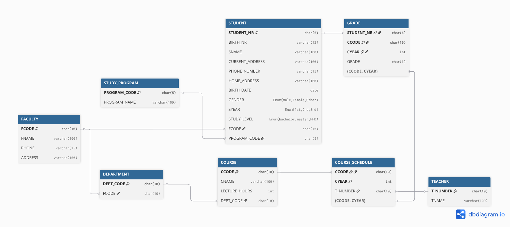

# DAT151: Assignment 2 Report

**Group:** 2

**Group Members:** Soukup Jan, Fabienne Feilke

**Date:** February , 2026

---

## Task 1: DBMS statements and utilities

Create some tables as a normal database user (i.e. not root), insert some test data into the tables, and test the following commands and/or utilities one by one. Try all commands both on a InnoDB and a MyISAM table. Document the input and output, and explain what you did in your words.

Use the MariaDB Knowledge Base to solve this task.

We first created the database tables and then input exampel data into both tables.

    ```sql
    MariaDB [assignment2]> show tables;
    +-----------------------+
    | Tables_in_assignment2 |
    +-----------------------+
    | my_innodb             |
    | my_myisam             |
    +-----------------------+
    2 rows in set (0.001 sec)

    MariaDB [assignment2]> describe my_innodb;
    +------------+--------------+------+-----+---------------------+----------------+
    | Field      | Type         | Null | Key | Default             | Extra          |
    +------------+--------------+------+-----+---------------------+----------------+
    | id         | int(11)      | NO   | PRI | NULL                | auto_increment |
    | name       | varchar(100) | YES  |     | NULL                |                |
    | age        | int(11)      | YES  |     | NULL                |                |
    | created_at | timestamp    | YES  |     | current_timestamp() |                |
    +------------+--------------+------+-----+---------------------+----------------+
    4 rows in set (0.002 sec)

    MariaDB [assignment2]> describe my_myisam;
    +------------+--------------+------+-----+---------------------+----------------+
    | Field      | Type         | Null | Key | Default             | Extra          |
    +------------+--------------+------+-----+---------------------+----------------+
    | id         | int(11)      | NO   | PRI | NULL                | auto_increment |
    | name       | varchar(100) | YES  |     | NULL                |                |
    | age        | int(11)      | YES  |     | NULL                |                |
    | created_at | timestamp    | YES  |     | current_timestamp() |                |
    +------------+--------------+------+-----+---------------------+----------------+
    4 rows in set (0.002 sec)

    MariaDB [assignment2]> INSERT INTO my_innodb (name, age) VALUES 
        -> ('Elias', 24),
        -> ('Bob', 29),
        -> ('Magnus', 35),
        -> ('Sofie', 22),
        -> ('Henrik', 41),
        -> ('John', 27);
    Query OK, 6 rows affected (0.008 sec)
    Records: 6  Duplicates: 0  Warnings: 0

    MariaDB [assignment2]> INSERT INTO my_myisam (name, age) VALUES  ('Elias', 24), ('Bob', 29), ('Magnus', 35), ('Sofie'
    , 22), ('Henrik', 41), ('John', 27);
    Query OK, 6 rows affected (0.001 sec)
    Records: 6  Duplicates: 0  Warnings: 0

    MariaDB [assignment2]> select * from my_innodb;
    +----+--------+------+---------------------+
    | id | name   | age  | created_at          |
    +----+--------+------+---------------------+
    |  1 | Elias  |   24 | 2026-02-16 12:19:50 |
    |  2 | Bob    |   29 | 2026-02-16 12:19:50 |
    |  3 | Magnus |   35 | 2026-02-16 12:19:50 |
    |  4 | Sofie  |   22 | 2026-02-16 12:19:50 |
    |  5 | Henrik |   41 | 2026-02-16 12:19:50 |
    |  6 | John   |   27 | 2026-02-16 12:19:50 |
    +----+--------+------+---------------------+
    6 rows in set (0.001 sec)

    MariaDB [assignment2]> select * from my_myisam;
    +----+--------+------+---------------------+
    | id | name   | age  | created_at          |
    +----+--------+------+---------------------+
    |  1 | Elias  |   24 | 2026-02-16 12:20:26 |
    |  2 | Bob    |   29 | 2026-02-16 12:20:26 |
    |  3 | Magnus |   35 | 2026-02-16 12:20:26 |
    |  4 | Sofie  |   22 | 2026-02-16 12:20:26 |
    |  5 | Henrik |   41 | 2026-02-16 12:20:26 |
    |  6 | John   |   27 | 2026-02-16 12:20:26 |
    +----+--------+------+---------------------+
    6 rows in set (0.001 sec)
    ```

1. **Convert table to InnoDB and to MyISAM**

    **ALTER TABLE** is used to alter the storage engine of a table. In this case, we are converting `my_innodb` to MyISAM and then back to InnoDB.

    InnoDB is the default storage engine as of MySQL 5.5, supports ACID, is transactional, supports foreign keys and has row level locking.

    MyISAM was the default storage engine before MySQL 5.5. It doesn't support ACID, is non-transactional, doesn't support foreign keys and has table level locking.

    ```sql
    MariaDB [assignment2]> ALTER TABLE my_innodb ENGINE=MyISAM;
    Query OK, 6 rows affected (0.034 sec)              
    Records: 6  Duplicates: 0  Warnings: 0

    MariaDB [assignment2]> ALTER TABLE my_innodb ENGINE=InnoDB;
    Query OK, 6 rows affected (2.252 sec)              
    Records: 6  Duplicates: 0  Warnings: 0

    MariaDB [assignment2]> select * from my_innodb;
    +----+--------+------+---------------------+
    | id | name   | age  | created_at          |
    +----+--------+------+---------------------+
    |  1 | Elias  |   24 | 2026-02-16 12:19:50 |
    |  2 | Bob    |   29 | 2026-02-16 12:19:50 |
    |  3 | Magnus |   35 | 2026-02-16 12:19:50 |
    |  4 | Sofie  |   22 | 2026-02-16 12:19:50 |
    |  5 | Henrik |   41 | 2026-02-16 12:19:50 |
    |  6 | John   |   27 | 2026-02-16 12:19:50 |
    +----+--------+------+---------------------+
    6 rows in set (0.001 sec)

    MariaDB [assignment2]> ALTER TABLE my_myisam ENGINE=MyISAM;
    Query OK, 6 rows affected (0.024 sec)              
    Records: 6  Duplicates: 0  Warnings: 0

    MariaDB [assignment2]> select * from my_myisam;
    +----+--------+------+---------------------+
    | id | name   | age  | created_at          |
    +----+--------+------+---------------------+
    |  1 | Elias  |   24 | 2026-02-16 12:20:26 |
    |  2 | Bob    |   29 | 2026-02-16 12:20:26 |
    |  3 | Magnus |   35 | 2026-02-16 12:20:26 |
    |  4 | Sofie  |   22 | 2026-02-16 12:20:26 |
    |  5 | Henrik |   41 | 2026-02-16 12:20:26 |
    |  6 | John   |   27 | 2026-02-16 12:20:26 |
    +----+--------+------+---------------------+
    6 rows in set (0.001 sec)
    ```

2. **SHOW INDEX**

    The SHOW INDEX command outputs information about indexes in the table. As we can see from the output, both tables have primary key on id, so the index is created automatically. Index type is B-Tree (default for both InnoDB and MyISAM). Cardinality is 6 for both cases - we have 6 different values in both tables.

    ```sql
    MariaDB [assignment2]> SHOW INDEX FROM my_innodb;
    +-----------+------------+----------+--------------+-------------+-----------+-------------+----------+--------+------+------------+---------+---------------+---------+
    | Table     | Non_unique | Key_name | Seq_in_index | Column_name | Collation | Cardinality | Sub_part | Packed | Null | Index_type | Comment | Index_comment | Ignored |
    +-----------+------------+----------+--------------+-------------+-----------+-------------+----------+--------+------+------------+---------+---------------+---------+
    | my_innodb |          0 | PRIMARY  |            1 | id          | A         |           6 |     NULL | NULL   |      | BTREE      |         |               | NO      |
    +-----------+------------+----------+--------------+-------------+-----------+-------------+----------+--------+------+------------+---------+---------------+---------+
    1 row in set (0.001 sec)

    MariaDB [assignment2]> SHOW INDEX FROM my_myisam;
    +-----------+------------+----------+--------------+-------------+-----------+-------------+----------+--------+------+------------+---------+---------------+---------+
    | Table     | Non_unique | Key_name | Seq_in_index | Column_name | Collation | Cardinality | Sub_part | Packed | Null | Index_type | Comment | Index_comment | Ignored |
    +-----------+------------+----------+--------------+-------------+-----------+-------------+----------+--------+------+------------+---------+---------------+---------+
    | my_myisam |          0 | PRIMARY  |            1 | id          | A         |           6 |     NULL | NULL   |      | BTREE      |         |               | NO      |
    +-----------+------------+----------+--------------+-------------+-----------+-------------+----------+--------+------+------------+---------+---------------+---------+
    1 row in set (0.001 sec)
    ```

3. **ANALYZE TABLE**

    This command analyzes and stores the key distribution for a table. This analysis is used by the optimizer to make better choices for query execution plans. InnoDB updates the index statistics dynamically, MyISAM needs to be updated manually. Command was successful for both tables.

    ```sql
    MariaDB [assignment2]> ANALYZE TABLE my_innodb;
    +-----------------------+---------+----------+----------+
    | Table                 | Op      | Msg_type | Msg_text |
    +-----------------------+---------+----------+----------+
    | assignment2.my_innodb | analyze | status   | OK       |
    +-----------------------+---------+----------+----------+
    1 row in set (0.004 sec)

    MariaDB [assignment2]> ANALYZE TABLE my_myisam;
    +-----------------------+---------+----------+----------+
    | Table                 | Op      | Msg_type | Msg_text |
    +-----------------------+---------+----------+----------+
    | assignment2.my_myisam | analyze | status   | OK       |
    +-----------------------+---------+----------+----------+
    1 row in set (0.001 sec)
    ```

4. **CHECK TABLE**

    This command checks a table for errors. Both tables returned OK status. InnoDB has built-in crash recovery, MyISAM tables are more likely to corrupt (after crashes). Command was successful for both tables.

    ```sql
    MariaDB [assignment2]> CHECK TABLE my_innodb;
    +-----------------------+-------+----------+----------+
    | Table                 | Op    | Msg_type | Msg_text |
    +-----------------------+-------+----------+----------+
    | assignment2.my_innodb | check | status   | OK       |
    +-----------------------+-------+----------+----------+
    1 row in set (0.000 sec)

    MariaDB [assignment2]> CHECK TABLE my_myisam;
    +-----------------------+-------+----------+----------+
    | Table                 | Op    | Msg_type | Msg_text |
    +-----------------------+-------+----------+----------+
    | assignment2.my_myisam | check | status   | OK       |
    +-----------------------+-------+----------+----------+
    1 row in set (0.001 sec)
    ```

5. **REPAIR TABLE**

    This command repairs a possibly corrupted table. InnoDB does not support `REPAIR TABLE`, because it has built-in crash recovery - If it’s corrupted, we need to restore from a backup. MyISAM supports REPAIR TABLE , status is OK, but no reparation was needed - table wasn't corrupted.

    ```sql
    MariaDB [assignment2]> REPAIR TABLE my_myisam;
    +-----------------------+--------+----------+----------+
    | Table                 | Op     | Msg_type | Msg_text |
    +-----------------------+--------+----------+----------+
    | assignment2.my_myisam | repair | status   | OK       |
    +-----------------------+--------+----------+----------+
    1 row in set (0.001 sec)

    MariaDB [assignment2]> REPAIR TABLE my_innodb;
    +-----------------------+--------+----------+---------------------------------------------------------+
    | Table                 | Op     | Msg_type | Msg_text                                                |
    +-----------------------+--------+----------+---------------------------------------------------------+
    | assignment2.my_innodb | repair | note     | The storage engine for the table doesn't support repair |
    +-----------------------+--------+----------+---------------------------------------------------------+
    1 row in set (0.000 sec)
    ```

6. **OPTIMIZE TABLE**

    This command reorganizes the physical storage of table data and associated index data, which leads to reduction in storage space and improvements of I/O efficiency when accessing the table. InnoDB does not support OPTIMIZE - database instead recreates the table and runs ANALYZE TABLE updating the table index statistics. InnoDB manages the space automatically, so the command is more useful with the MyISAM engine, which supports the command and it was succesfully run

    ```sql
    MariaDB [assignment2]> OPTIMIZE TABLE my_innodb;
    +-----------------------+----------+----------+-------------------------------------------------------------------+
    | Table                 | Op       | Msg_type | Msg_text                                                          |
    +-----------------------+----------+----------+-------------------------------------------------------------------+
    | assignment2.my_innodb | optimize | note     | Table does not support optimize, doing recreate + analyze instead |
    | assignment2.my_innodb | optimize | status   | OK                                                                |
    +-----------------------+----------+----------+-------------------------------------------------------------------+
    2 rows in set (0.049 sec)

    MariaDB [assignment2]> OPTIMIZE TABLE my_myisam;
    +-----------------------+----------+----------+----------+
    | Table                 | Op       | Msg_type | Msg_text |
    +-----------------------+----------+----------+----------+
    | assignment2.my_myisam | optimize | status   | OK       |
    +-----------------------+----------+----------+----------+
    1 row in set (0.001 sec)
    ```

7. **CHECKSUM TABLE**

    This command reports a checksum for the contents of a table. This value can be used to detect any changes in the table’s data. If the data changed, there will be a different checksum.

    ```sql
    MariaDB [assignment2]> CHECKSUM TABLE my_innodb;
    +-----------------------+------------+
    | Table                 | Checksum   |
    +-----------------------+------------+
    | assignment2.my_innodb | 2122584765 |
    +-----------------------+------------+
    1 row in set (0.001 sec)

    MariaDB [assignment2]> CHECKSUM TABLE my_myisam;
    +-----------------------+------------+
    | Table                 | Checksum   |
    +-----------------------+------------+
    | assignment2.my_myisam | 2206389053 |
    +-----------------------+------------+
    1 row in set (0.001 sec)
    ```

8. **innochecksum**

    This is a command-line utility that can be used to check the checksums of InnoDB files offline - .idb files. By default, innochecksum reports only errors or mismatches.

    ```bash
    innochecksum /var/lib/mysql/assignment2/my_innodb.ibd
    All are zero-filled pages.
    ```

9. **myisamchk**

    This is a command-line utility that gets information about MyISAM tables by checking the .MYI and .MYD files and can be used to check, repair, and optimize them. The output shows no issues. It also shows that we have 6 data records and 0 deleted blocks (no need to optimize, if some corruption was found, we could use `myisamchk --repair` to repair the table.

    ```bash
    myisamchk /var/lib/mysql/assignment2/my_myisam.MYI
    Checking MyISAM file: /var/lib/mysql/assignment2/my_myisam.MYI
    Data records:       6   Deleted blocks:       0
    - check file-size
    - check record delete-chain
    - check key delete-chain
    - check index reference
    - check data record references index: 1
    - check record links
    ```

---

## Task 2: Normalisation

This task is theory only. You do not need to implement anything on the lab computers.

Below a relation (table) is given, including example data.

You can assume that ENAME is atomic.

What normal form does it currently conform to? Normalize it to 3NF if it does not currently conform to 3NF.

### Answers

//TODO This should be fine, just recheck

- The schema currently conforms to the 1NF (atomic values)
- It violates the 2NF for the following reasons:
  - ENAME depends only on the SSN, which is only a part of the composite primary key
  - PNAME and PLOCATION depend on PNUMBER, which is also only a part of the composite primary key
- We can normalize the schema into 3NF by making it more tables - 3 tables to be exact - EMP (Employee), PROJ (Project) and EMP_PROJ. The tables will have following data:
  - EMP (SSN, ENAME)
  - PROJ (PNUMBER, PNAME, PLOCATION)
  - EMP_PROJ (SSN, PNUMBER, HOURS)
    - SSN and PNUMBER are both foreign keys referenced from EMP and PROJ tables
- After the changes, the schema is in the 3NF, actually even in BCNF, because all functional dependencies are either trivial or have full candidate key on the left side

---

## Task 3: More normalization

This task is theory only. You do not need to implement anything on the lab computers.

Below a relation (table) is given, including example data.

You can assume that ENAME and ADDRESS are atomic.

Which normal form does it currently conform to? Normalize it to 3NF if it does not currently
conform to 3NF.

### Answers

//TODO Rewrite this and check it again

- The schema currently conforms to the 1NF (atomic values)
- It also conform the 2NF (no non-key attribute is dependent on part of a composite key),
  - 2NF allows non-key attribute to be dependent on a non-key attribute, so DNUMBER → DNAME, DMGRSSN is okay
- It violates the 3NF, because non-key attributes DNAME and DMGRSSN are dependent on the key transitively using another non-key attribute DNUMBER
- We can normalize it to the 3NF by making it into 2 tables - EMP and DEPT
- EMP (SSN, ENAME, BDATE, ADDRESS, DNUMBER)
  - DNUMBER is foreign key referenced from the DEPT table
- DEPT (DNUMBER, DNAME, DMGRSSN)

## Task 4: Normalisation & Denormalisation

```sql
Table Faculty {
  f_code varchar(10) [pk]
  f_name varchar(100) [unique]
  phone varchar(15)
  address varchar(100)
}

Table Department {
  dept_name varchar(100) [pk]
  f_code varchar(10) [ref: > Faculty.f_code]
}

Table StudyProgram {
  program_code varchar(15) [pk]
  program_name varchar(100)
  study_level Enum('Bachelors', 'Masters', 'PhD')
  f_code varchar(10) [ref: > Faculty.f_code]
}

Table Student {
  student_nr varchar(15) [pk]
  birth_nr varchar(12) [unique]
  s_name varchar(100)
  current_address varchar(100)
  phone_number varchar(15)
  home_address varchar(100)
  birth_date date
  s_gender Enum ('Male', 'Female', 'Other')
  s_year Enum ('1st', '2nd', '3rd')
  program_code varchar(15) [ref: > StudyProgram.program_code]
}

Table Teacher {
  t_number int [pk]
  t_name varchar(100)
}

Table Course {
  c_code varchar(10) [pk]
  c_name varchar(100)
  lecture_hours_per_week int
  dept_name varchar(100) [ref: > Department.dept_name]
}

Table CourseSchedule {
  c_code varchar(10) [ref: > Course.c_code]
  c_year int
  teacher_number int [ref: > Teacher.t_number]

  indexes {
    (c_code, c_year) [pk]
  }
}

Table Grade {
  student_nr varchar(15) [ref: > Student.student_nr]
  c_code varchar(10)
  c_year int
  grade char(1)

  indexes {
    (student_nr, c_code, c_year) [pk]
  }
}

Ref: Grade.(c_code, c_year) > CourseSchedule.(c_code, c_year)
```



### MariaDB Implementation

```sql
MariaDB [PRIVBASE]> show tables;
Empty set (0.001 sec)

MariaDB [PRIVBASE]> CREATE TABLE FACULTY (
    ->     f_code VARCHAR(10) PRIMARY KEY,
    ->     f_name VARCHAR(100) UNIQUE,
    ->     phone VARCHAR(15),
    ->     address VARCHAR(100)
    -> );
Query OK, 0 rows affected (0.043 sec)

MariaDB [PRIVBASE]> CREATE TABLE DEPARTMENT (
    ->     dept_name VARCHAR(100) PRIMARY KEY,
    ->     f_code VARCHAR(10),
    ->     FOREIGN KEY (f_code) REFERENCES FACULTY(f_code) ON DELETE CASCADE
    -> );
Query OK, 0 rows affected (0.024 sec)

MariaDB [PRIVBASE]> CREATE TABLE STUDY_PROGRAM (
    ->     program_code VARCHAR(15) PRIMARY KEY,
    ->     program_name VARCHAR(100),
    ->     study_level ENUM('Bachelors', 'Masters', 'PhD'),
    ->     f_code VARCHAR(10),
    ->     FOREIGN KEY (f_code) REFERENCES FACULTY(f_code) ON DELETE CASCADE
    -> );
Query OK, 0 rows affected (0.028 sec)

MariaDB [PRIVBASE]> CREATE TABLE STUDENT (
    ->     student_nr VARCHAR(15) PRIMARY KEY,
    ->     birth_nr VARCHAR(12) UNIQUE,
    ->     s_name VARCHAR(100),
    ->     current_address VARCHAR(100),
    ->     phone_number VARCHAR(15),
    ->     home_address VARCHAR(100),
    ->     birth_date DATE,
    ->     s_gender ENUM('Male', 'Female', 'Other'),
    ->     s_year ENUM('1st', '2nd', '3rd'),
    ->     program_code VARCHAR(15),
    ->     FOREIGN KEY (program_code) REFERENCES STUDY_PROGRAM(program_code) ON DELETE SET NULL
    -> );
Query OK, 0 rows affected (0.025 sec)

MariaDB [PRIVBASE]> CREATE TABLE TEACHER (
    ->     t_number VARCHAR(20) PRIMARY KEY,
    ->     t_name VARCHAR(100)
    -> );
Query OK, 0 rows affected (0.019 sec)

MariaDB [PRIVBASE]> CREATE TABLE COURSE (
    ->     c_code VARCHAR(10) PRIMARY KEY,
    ->     c_name VARCHAR(100),
    ->     lecture_hours_per_week INT,
    ->     dept_name VARCHAR(100),
    ->     FOREIGN KEY (dept_name) REFERENCES DEPARTMENT(dept_name) ON DELETE CASCADE
    -> );
Query OK, 0 rows affected (0.032 sec)

MariaDB [PRIVBASE]> CREATE TABLE COURSE_SCHEDULE (
    ->     c_code VARCHAR(10),
    ->     c_year INT,
    ->     teacher_number VARCHAR(20),
    ->     PRIMARY KEY (c_code, c_year),
    ->     FOREIGN KEY (c_code) REFERENCES COURSE(c_code) ON DELETE CASCADE,
    ->     FOREIGN KEY (teacher_number) REFERENCES TEACHER(t_number) ON DELETE SET NULL
    -> );
Query OK, 0 rows affected (0.028 sec)

MariaDB [PRIVBASE]> CREATE TABLE GRADE (
    ->     student_nr VARCHAR(15),
    ->     c_code VARCHAR(10),
    ->     c_year INT,
    ->     grade CHAR(1),
    ->     PRIMARY KEY (student_nr, c_code, c_year),
    ->     FOREIGN KEY (student_nr) REFERENCES STUDENT(student_nr) ON DELETE CASCADE,
    ->     FOREIGN KEY (c_code, c_year) REFERENCES COURSE_SCHEDULE(c_code, c_year) ON DELETE CASCADE
    -> );
Query OK, 0 rows affected (0.023 sec)

MariaDB [PRIVBASE]> show tables;
+--------------------+
| Tables_in_PRIVBASE |
+--------------------+
| COURSE             |
| COURSE_SCHEDULE    |
| DEPARTMENT         |
| FACULTY            |
| GRADE              |
| STUDENT            |
| STUDY_PROGRAM      |
| TEACHER            |
+--------------------+
8 rows in set (0.001 sec)
```

**c) For each of the following SQL-queries, propose a concrete solution for a denormalized model of the schema from a). Discuss whether the denormalised model might improve performance:**

1. `SELECT s.SNAME, f.FNAME FROM STUDENT s, FACULTY f WHERE s.FCODE = f.FCODE;`


2. `SELECT COUNT(*) FROM STUDENT WHERE FCODE = 'FTMS';`


3. `SELECT DISTINCT CYEAR FROM COURSE_SCHEDULE;`
