# DAT151: Assignment 4 Report

**Group:** 5

**Group Members:** Soukup Jan, Fabienne Feilke

**Date:** March ..., 2026

This report was written after Monday's 16.3. review during lab.

---

## Task 1: Triggers

*Objective: As a normal database user (i.e. not root), create triggers on table TheTable so that all changes of TheTable will be logged in LogTable. Make sure all values before and after a change are logged.*

**Requirements:**
* For DELETE, you must log the action DELETE, and the row before values.
* For INSERT, you must log the action INSERT, and the row after values.
* For UPDATE, you must log the action UPDATE, and both the row before and after values.
    * The LogTable must clearly identify the old and the new values.

**Delivery:**
* The DDL of the triggers
* The DDL of the tables
* Output that demonstrates the working of the triggers
  
Creating the Tables:

Insert Trigger:

Update Trigger:

Delete Trigger:

Demonstrate the working of the triggers:

---

## Task 2: Temporal database

*Objective: As a normal database user (i.e. not root), create a table AnotherTable as a System-Versioned table. Insert some data, then do some DELETEs, UPDATEs and INSERTs.*

**Requirements:**
* Do not manually create a ROW_START or ROW_END column.
* After all modifications are done, use queries with “FOR SYSTEM_TIME AS OF” to list the before and after values after each modification of the table.
* Every result set should show the state of the table at a specific point in time. Each result sets should include a row only once, showing the state of the row at that specific point in time.

Creating the Table with data and using DELETE, UPDATE and INSERT:

List the befor and after values after each modification: 

Showing the state of the row at that specific point in time:

---

## Task 3: Integrity Constraints

*Objective: As a normal database user (i.e. not root), create a teacher table, with numeric attributes for salary, bonus and total.*

**1. Implement the following integrity constraints:**
i. The attribute salary must be between 1 000 and 100 000.
ii. The attribute total must be the sum of salary and bonus, and calculated automatically.

*Insert some test data to verify whether your solution works. Document the output.*

Implementation:

Verification:

**2. Is the table 3NF?**

For a table to be in 3NF, every non-prime attribute must be non-transitively dependent on the primary key. In this table, the total depends on salary and bonus rather than just the primary key (ID), therefore, the table is not in 3NF.

## Task 4: Order of triggers

**1. Test the following, and give necessary explanations:**
a) Create three tables T1, T2, and T3.
b) Create a trigger tr12 before insert on T1, insert into T2 a row.
c) Create a trigger tr23 after insert on T2, insert into T3 a row.
d) Create a trigger tr13 after insert on T1, insert into T3 a row.
e) Insert a row into T1, in which order are the triggers fired? Why?

First just creating simple tables to show the workings of triggers

Creation of all triggers according to the task

After simple insert into T1 we show the content of all tables

The triggers fire in the following order:

`TR12` -> `TR23` -> (Data is INSERTED into `T1`) -> `TR13`

This is because of the cascading triggers.

When we `INSERT` into `T1` the engine first checks for `BEFORE` triggers -> `TR12` fires first.

`TR12` executes `INSERT` into `T2` - trigger execution is synchronous, so MariaDB pauses the original operation `T1` to handle `T2`.

`INSERT` on `T2` fires its own `AFTER` trigger - `TR23`, which inserts a row into `T3`.

After the operations on `T2` (and its triggers) are complete, engine returns to `T1` and the value is insterted into `T1`.

Then the `AFTER INSERT` trigger `TR13` is fired on `T1`, which inserts the row into `T3`.

**2. Can there be any unexpected result or deadlock regarding the order of triggers?**

Yes, there can be unexpected results and deadlocks. If the triggers form a loop (for example T3 trigger would insert into T1) it would cause infinite recursion. Database engines usually catch this and throw a "maximum recursion depth exceeded" error, which crashes the original transaction.

Also a simple `INSERT` into `T1` can lock `T2` and `T3` with the triggers - could cause performance drops.

---

## Task 5: Pendant DELETE

*Objective: Implement the following as a normal database user (i.e. not root):*

1. Create two tables with a one-to-many relation, and implement referential integrity. (Create foreign keys on the “many”-table).
2. Add some rows to each table. The child table must have several rows referencing each row of the parent rows.
3. Use triggers to implement the rule known as pendant DELETE (Mullins page 435): A row in the parent table should be deleted if no rows in the child table refer to it any more (when you delete the last row in the child table referencing it).

First we again create simple tables: parent table with 1:N relation to child table. We decided to use simple electronics categories and products for the task.

Inserting data into the tables to form 1:N relations.

Creating a pendant delete trigger - if the child table does not have any values referencing the parent value, delete parent value as well.

Deletion of one categories items - the category gets deleted after the last product is deleted, as expected.

**Explain the point of doing this and why it is difficult compared with other rules on p.435.**

1. What is the point of a Pendant DELETE?
The purpose of a pendant DELETE is to prevent parent records that no longer serve a purpose - as they do not have any children associated with them. In many business logic scenarios (like a category that only exists to group of active products), a parent record becomes meaningless or clutters the database if it doesn't have any children associated with it. Pendant DELETE automates the cleanup of these empty parent containers.

2. Why is it difficult compared with other rules?

No Native Support: Standard referential integrity rules (like ON DELETE CASCADE or ON DELETE SET NULL that are listed on the page 435) flow "downwards" from parent to child. They are built natively into SQL engines. Pendant DELETE flows "upwards" (child to parent) and has no native constraint syntax - it must be custom-coded using triggers.

It introduces concurrency and locking risks. For example, if transaction A deletes the last child row and fires the trigger to delete the parent, while at the exact same time transaction B tries to insert a new child row for that same parent, a race condition or deadlock can occur. Transaction B might successfully insert a child pointing to a parent that transaction A just deleted, completely breaking referential integrity. Proper table/row locking is required to do this safely.

---

## Task 6: Concurrency

*Objective: An application uses a DBMS to store data about events and participants. Events can have many participants, but the number of spaces should still be limited.*

**6.1 Normalization and Data Loading**

1. Make a normalized, 3NF logical for the data provided in `data.txt` and implement the model in a MariaDB database using InnoDB tables. The model should have an attribute showing the total number of spaces at each event.
*(The fastest, and probably also easiest solution is to create a table that temporarily holds all the data. From this table, load data into the normalized tables and afterwards delete the auxiliary table.)*

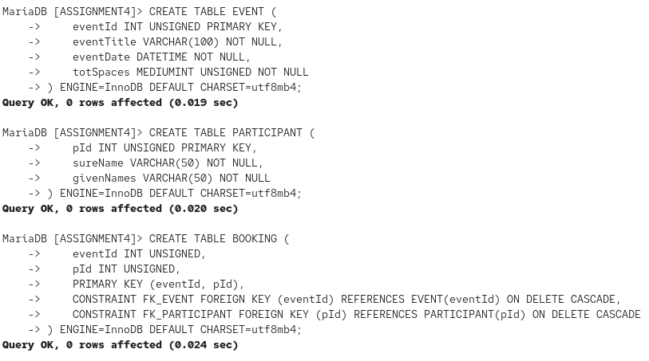

First we created the tables in 3NF.

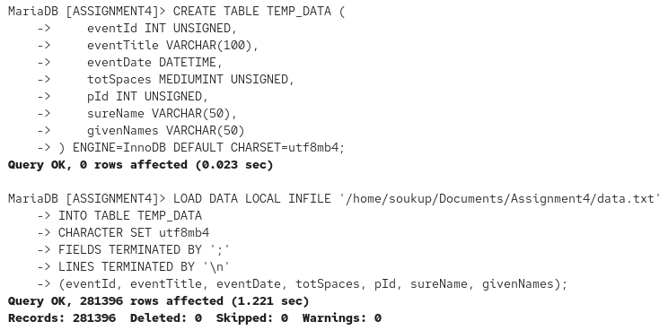

Then we created a dummy table to load all the data from the [`data.txt`](data.txt) file into. We had to use `CHARACTER SET utf8mb4` while loading to ensure we load the characters as intended.

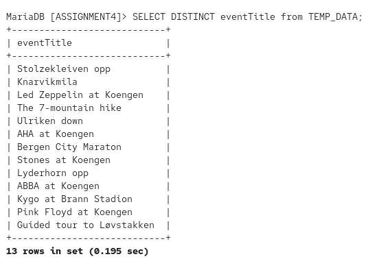

Verification select to see if the data was loaded correctly as well as the characters.

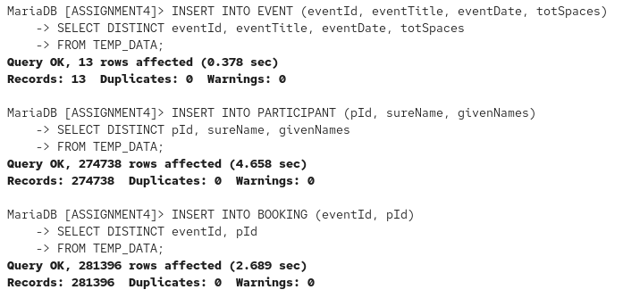

Inserting the data into their respective tables.

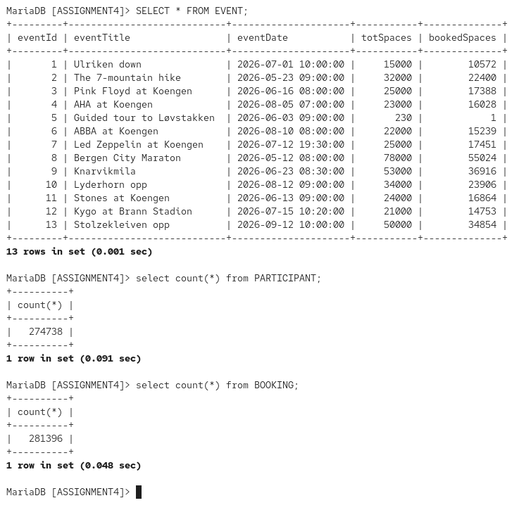

Verification selects to make sure we loaded the data correctly into the tables.

After the tables vere verified we deleted the temporary dummy table.

**6.2 Validation Queries**

2. Before continuing, you must confirm that your model is working, and that the data got correctly loaded into the database. Formulate the queries below and test your database.

i. Find the maximum number of events that a single participant will attend. (Avoid ORDER BY)

ii. List names of the participants that attend the largest number of events. (Do not use LIMIT, Avoid ORDER BY)

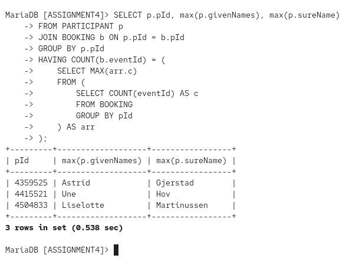

After the review this was done we changed it to use `max()` instead of our initial `group by` query with the data.

iii. What events are attended by Ludvig Rustad?

iv. List participants that attend exactly 3 events.

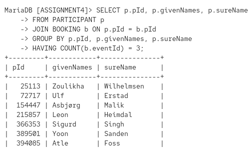

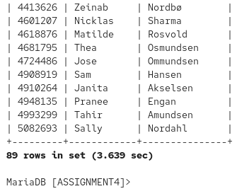

v. What events do they attend, the participants that attend 3 events? (Your query should not refer explicitly to any events, nor eventId equal to 5)

vi. Are there any events that is not attended by anybody that attends three events? (Your query should not refer explicitly any of the events)

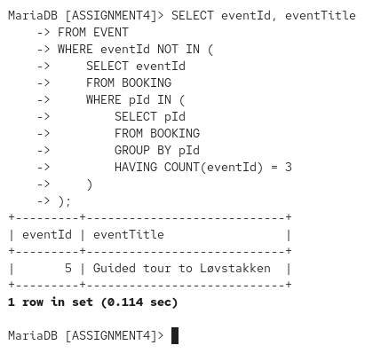

vii. Are there any events that is attended only by the participants that attend only one event? (Your query should not refer explicitly any of the events)

The first query that we discussed was wrong at the time.

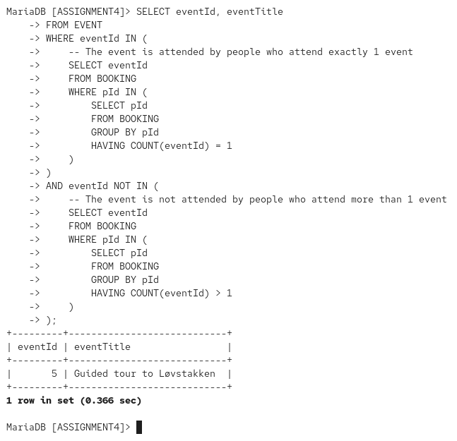

Query fixed with the `AND` clause

**6.3 Stored Procedure takeSpace**

3. Make a stored procedure `takeSpace` that will book a space for an existing participant at an event.
* If there are available spaces at the event, book a space for the participant.
* If the event is sold out, do nothing.
* The procedure should be accessible by concurrent users, i.e. locking is required with a 3NF model.
* The stored procedure should not modify column totSpaces of the table Event.

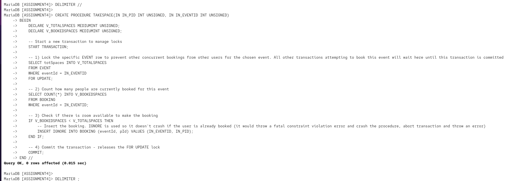

The first try at the procedure - we discussed that it would not lock the correct table but in the end it also does, at least from the lecturers comment we got after the lab.

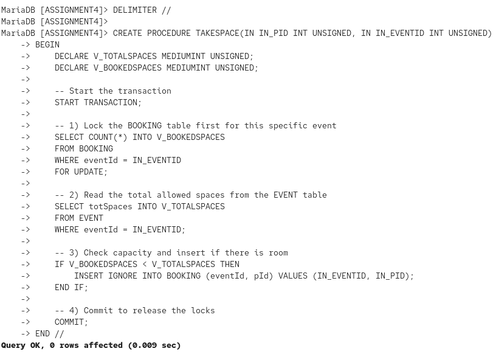

Second try to lock the table correctly.

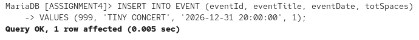

Create new concert event.

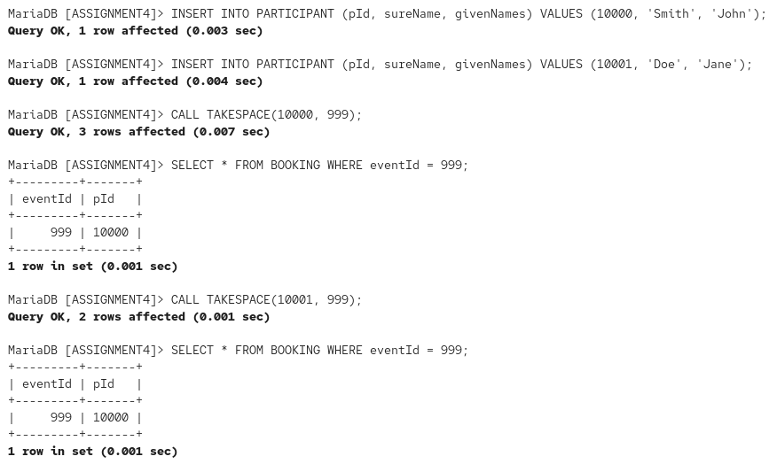

Testing the stored procedure. This works, but for actual robust testing we would need to try multiple concurrent queries.

**6.4 Profiling**

4. Start profiling and check the time consumption used by the stored procedure when booking a space at an event. What takes most time?
* Discuss how multiple concurrent bookings for the same event would influence the time consumption.

Setup and following profiling queries

**What takes most time?**

Operations involving disk I/O take the most time, sending the data, updating and commit.

*** Discuss how multiple concurrent bookings for the same event would influence the time consumption.**

Because our procedure uses a pessimistic lock `SELECT ... FOR UPDATE`, it prevents parallel processing for the same event row.

If 1,000 users try to book a space at the same event at the same time, the first user locks the row. The rest of the users are placed in a waiting queue.

User 2 cannot start checking the available spaces until User 1 finishes their entire process and commits (releasing the lock).

Therefore, the time consumption for concurrent users will degrade linearly. The 100th user's transaction will take significantly longer to complete than the 1st user's because their total time includes the execution time of the 99 transactions ahead of them in the lock queue.

**6.5 Denormalisation**

5. Can you advice a denormalisation scheme that would reduce the time consumption?
* Implement the new model, and update `takeSpace` to take the new model into account. Try to avoid the need for explicit locks in the updated version of `takeSpace`.
* Use profiling and measure the time consumption when booking a space at an event with the new version `takeSpace`.

Updating the EVENT table with new column `booked spaces` that counts the number of bookings for the event.

Updating the procedure to now work with the edited table.

Profiling new data and showing the results.

The longest time now take the commits. Our old method's SELECT COUNT(*) took 0.0255 seconds. The new method completed the entire atomic UPDATE in 0.0020 seconds.

We now don't have any explicit locks - there is no `START TRANSACTION` or `FOR UPDATE` in queries 6 and 7. By moving the logic to a single UPDATE statement, the database engine handles the concurrency automatically.
